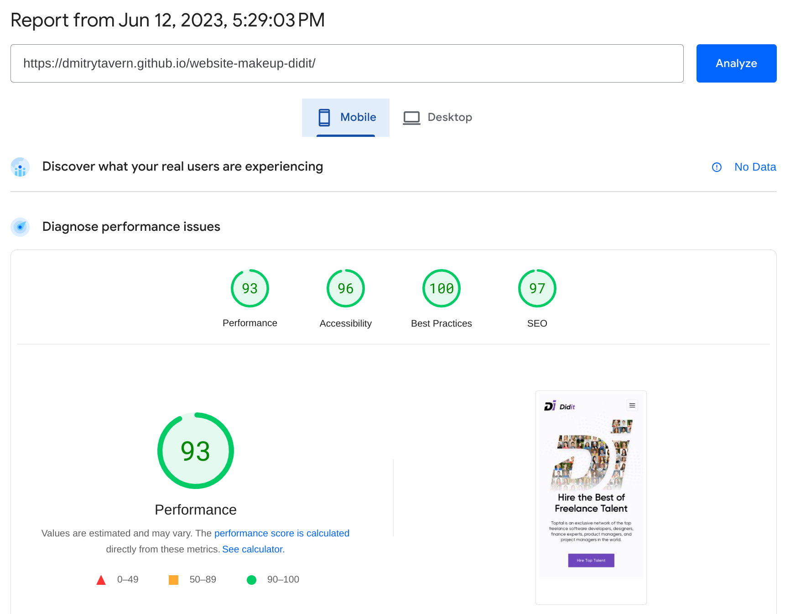
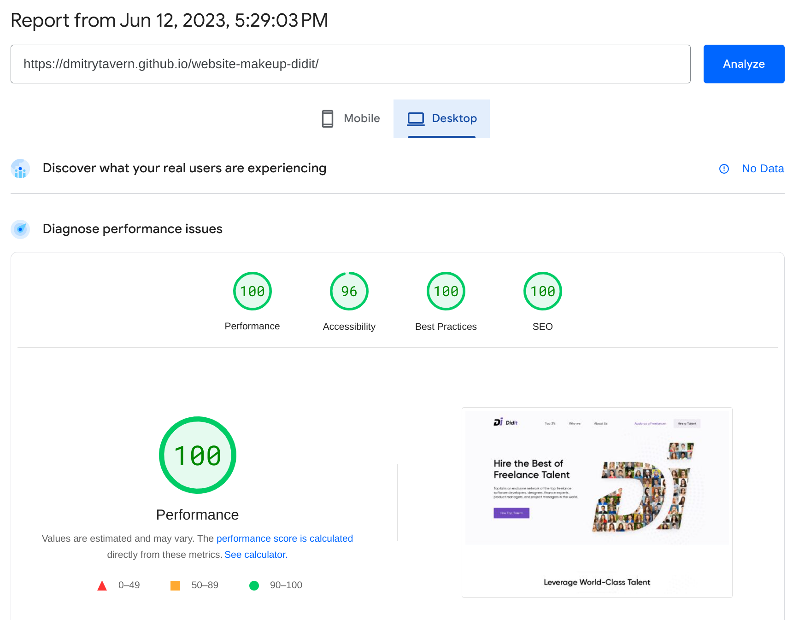
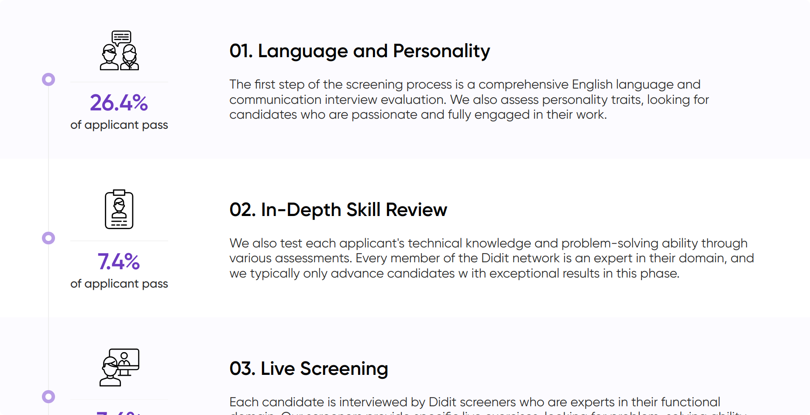
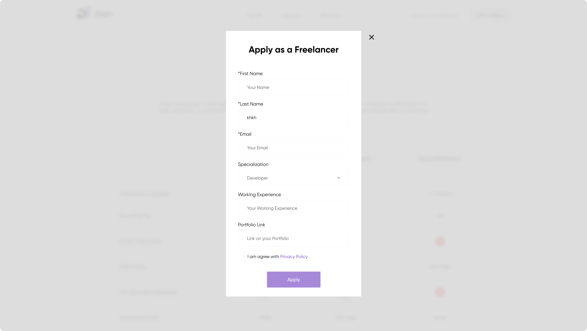

# **Didit**

The **Didit** website is a very small platform designed to connect customers and performers in various fields. Didit searches for specialists in various fields such as development, design, project management and many others. See [**demo**](https://dmitrytavern.github.io/website-makeup-didit/).

**Developers:**

- [Dmitry Tavern (developer)](https://github.com/dmitrytavern).
- [Lyovushkin Kyrylo (designer)](https://www.instagram.com/k.lyovushkin/).

**Screenshot:**


## Formulation of the problem

Create a cross-browser, adaptive website by design in Sketch. Key points for adaptability: **375px**, **768px**, **1100px**, **1600px**. There are no additional requirements.

Pages to create:

- [Home](https://dmitrytavern.github.io/website-makeup-didit/)
- [About us](https://dmitrytavern.github.io/website-makeup-didit/about.html)
- [Why we](https://dmitrytavern.github.io/website-makeup-didit/advantages.html)
- [Top 3%](https://dmitrytavern.github.io/website-makeup-didit/top.html)

## Technologies

&nbsp;
&nbsp;
&nbsp;
&nbsp;
&nbsp;
&nbsp;
&nbsp;
&nbsp;
&nbsp;
&nbsp;
&nbsp;
&nbsp;
&nbsp;
&nbsp;
&nbsp;
&nbsp;

## Performance

Since the project was old, only now I added support for webp, compressed all the images and added attributes to the tags img.

The site loads very quickly and has green positions on all metrics:

&nbsp;
&nbsp;

## Problems

### 01. Implementation of an improvised roadmap

The [Top 3%](https://dmitrytavern.github.io/website-makeup-didit/top.html) page needed to implement a roadmap that explained what stages the candidate went through in the Didit network. Each stage section/card has a point that connects to the point above and below. When adaptive, the height of the card could be unpredictable. This was the first time I had ever laid out something like this.

**Solution:** In the end, everything was implemented using pseudo elements and standard css tools.



### 02. Implementation of a form for submitting a request

The task involves creating a handler on the form, which will validate all fields, display errors if something is not correctly entered or selected. It was also necessary to recreate the select tag according to the design.

**Solution:** The form was made with jQuery, the submission - with ajax. Reaction to input or pressing a button was also made with jQuery.



### 03. Implementing a dynamic slider

The [main page](https://dmitrytavern.github.io/website-makeup-didit/) has a block that shows the current project team. On the phone version it is a slider, and on the desktop it is the usual three-column grid. The challenge was to dynamically create a slider when the window was resized, or to destroy it if it was active. In addition, it is necessary to consider the creation of hidden sliders that are in other tabs.

**Solution:** I chose Swiper as a slider. It had all the necessary options to create a slider for blocks that are hidden. It was implemented in three functions. One creates mobile sliders, the second removes them, the third decides which of the two functions to run.


## Conclusions

As I am writing this text long after the end of the project, I have come to the following conclusions:

- **Too much JS.** If we look at what scripts the page loads, we get **bootstrap.bundle.min.js (82.1kb)**, **jquery.min.js (87.7kb)**, **swiper-bundle.min.js (138kb)**. This is too much for such simple site and most things could be easily implemented natively. Subsequently I gave up using jquery and bootstrap, but this site reminds me of that mistake.

- **Webpack is the problem.** Although I continued to use this builder, I have now come to the conclusion that this tool is not suitable for creating such sites. Changing one page compiles all of them, loads a lot of unnecessary js, and lacks all the benefits of webpack. Now I use gulp.

- **jQuery is too bad.** After React and Vue, even the jQuery code I wrote is already bad for form validation, error rendering and where there is logic.

- **Strange initial loading.** If you disable caching and reload the page many times, you can notice the appearance and instant disappearance of various elements (for example, a modal window). This is due to the fact that these elements are not hidden by `display: none` and have an animation via transition that propagates to all properties. Now I pay attention to this and try not to make such mistakes.

- The entire layout, given the 2020 experience, took 27 hours, which is quite a lot for a project like this. Now I can layout sites more complex, with more pages in just 20 hours.

## Guide

If you only need a finished build, you can download it from the [latest release](https://github.com/dmitrytavern/website-makeup-didit/releases/latest/download/website-makeup.tar.gz).

This project is obsolete and uses an older version of **Node.js** - **v16.20.0**. There may be errors on newer versions. Make sure you are using this version of Node.js.

There may also be problems running on **Windows** or **MacOs** because the webpack config may not be ready due to different implementation paths.

Steps to manually build a project:

1. Clone a repository:

```
git clone https://github.com/dmitrytavern/website-makeup-didit.git
```

2. Install dependencies:

```
npm ci
```

3. Run a command:

```
npm run dev
npm run build
npm run build:serve
```

- **npm run dev** - launches a live-reload webpack dev server for development.
- **npm run build** - builds the entire project in a production version.
- **npm run build:serve** - runs the production server to test the finished build.

## License

MIT - check repo files

Copyright (c) 2020-present, Dmitry Tavern
